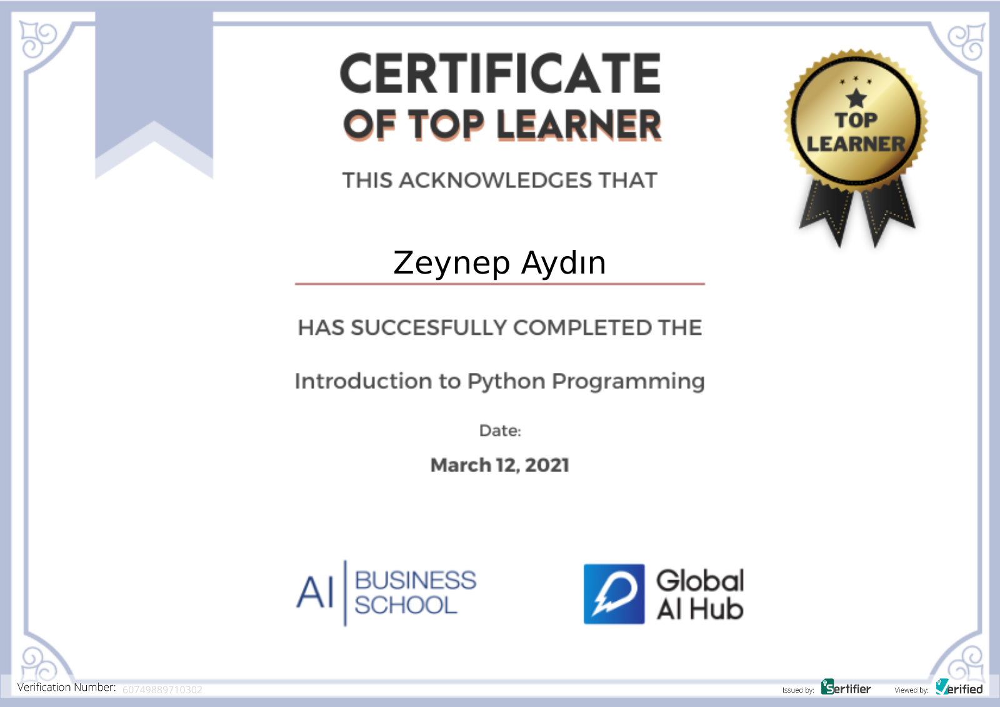

# Global AI Hub Python Course

**Course Date:** 08.03.2021  
**Name:** Zeynep  
**Surname:** Aydın  
**Email:** zeynepaydin2211@gmail.com  

This repository was prepared by Zeynep Aydın to meet the Global AI Hub Top Learner program requirements for the Introduction to Python course. It consists of 3 homeworks and 1 final project. The final project is described below.  

## Knowledge Competition
A 10-question competition, each with only one correct answer worth 10 points, was created. Answers to the questions were received from the user. If the user gave more than five correct answers, he/she was deemed successful, otherwise unsuccessful.    

## Requirements
No requirements have been specified for this repository.  

---

### Certification

